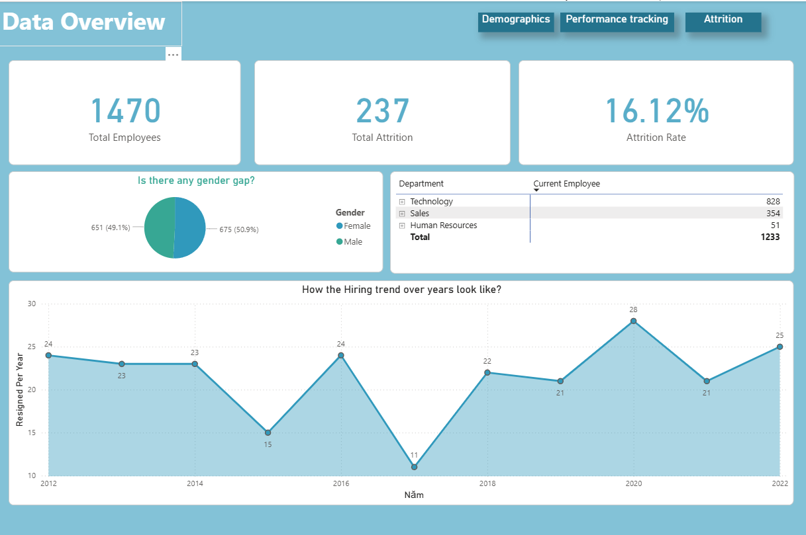
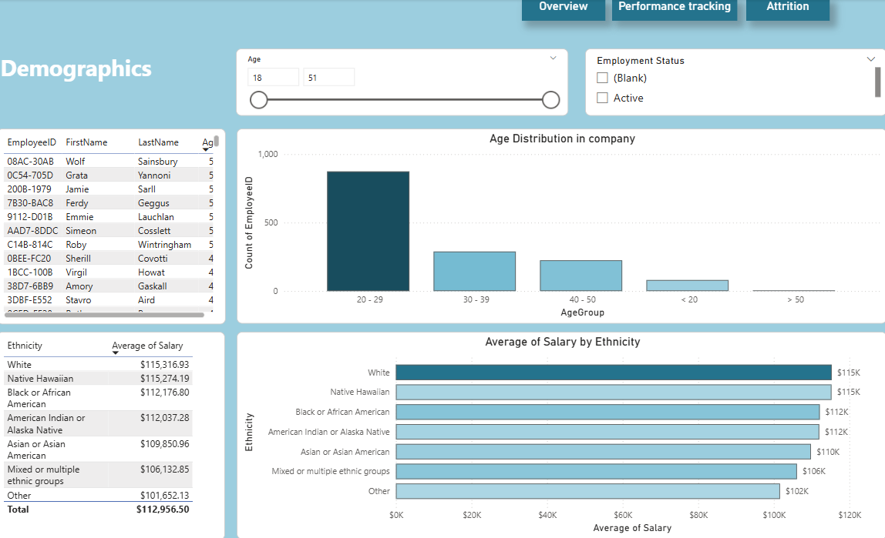
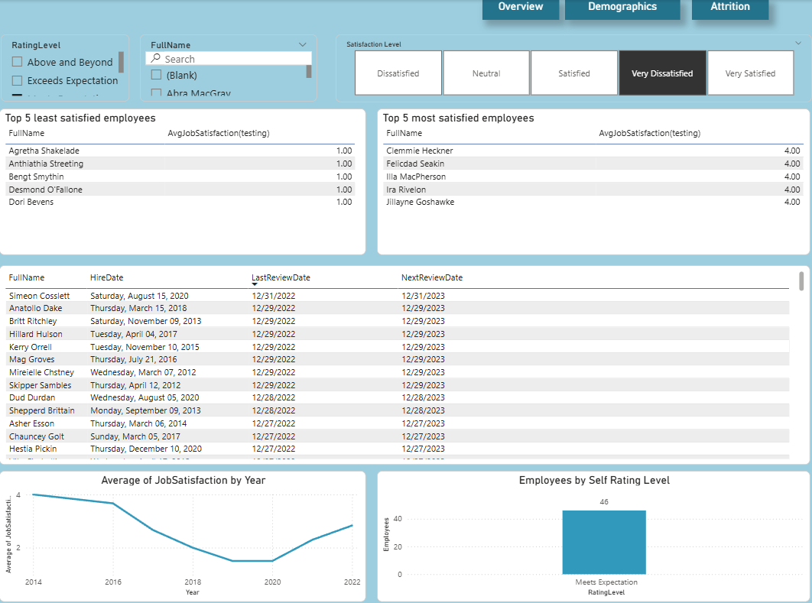
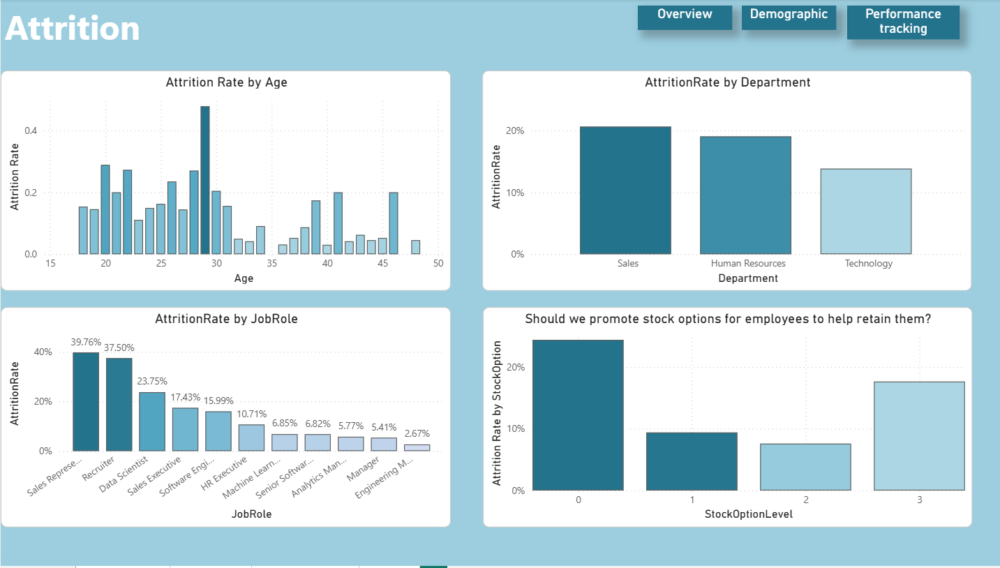

# employee-attrition-analytics-powerbi
# Employee Attrition & Performance Analytics (Power BI)

## 📌 Project Overview
This project analyses employee attrition, demographics, and performance data using Power BI to uncover key workforce trends and retention risks.  
The dashboard is designed to support HR and People Analytics decision-making by identifying *who is leaving, where risks are concentrated, and why employees may disengage*.

---

## 🎯 Key Business Questions
- Which employee groups experience the highest attrition?
- How does attrition vary by age, department, and job role?
- Do stock options help reduce employee attrition?
- How has job satisfaction evolved over time?
- Are performance ratings aligned with job satisfaction?

---

## 📊 Dashboard Pages
### 1. Data Overview
- Total employees, attrition count, and attrition rate
- Gender distribution and department headcount
- Employee hiring and attrition trends over time

### 2. Demographics
- Age distribution of employees
- Salary distribution by ethnicity
- Interactive filters for age range and employment status

### 3. Attrition Analysis
- Attrition rate by age, department, and job role
- Impact of stock option levels on attrition risk
- Identification of high-risk employee segments

### 4. Performance Tracking
- Top 5 most and least satisfied employees
- Job satisfaction trend over time
- Distribution of self-rated performance levels

---

## 🔍 Key Insights
- Attrition is concentrated among early-career employees and sales-related roles.
- Employees without stock options experience significantly higher attrition.
- Job satisfaction has declined post-2020 and has not fully recovered.
- High self-rated performance does not necessarily translate into high job satisfaction.

---

## 🛠 Tools & Skills Used
- Power BI (Data modelling, DAX, interactive visuals)
- DAX measures for Top-N ranking and context-aware analysis
- Data visualisation & storytelling
- HR analytics & business insight generation

---

## 📁 Files Included
- Power BI dashboard (`.pbix`)
- Source dataset (`.csv`)
- Dashboard screenshots for preview
- Data dictionary for reference

---
## 📊 Power BI File

The Power BI report file (`.pbix`) is included for transparency and reproducibility.

- Contains the full data model, DAX measures, and interaction logic
- Built using a publicly available HR dataset
- Intended for local exploration and portfolio demonstration

To view the report:
1. Download the `.pbix` file
2. Open with Power BI Desktop

---

## 🚀 Next Steps
- Build a predictive attrition model
- Segment attrition risk by tenure and role
- Incorporate manager-level and workload metrics

---

## 📷 Dashboard Preview

